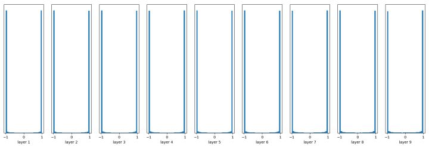

# 深度学习实践总结
## 1. 自然语言处理中如何进行数据增强
NLP 中应用数据增强比较困难的原因有两点：
- <font color='red'>NLP中的数据是离散的</font>。它的后果是我们无法对输入数据进行直接简单地转换，而大多数CV中则没有这个限制；
- <font color='red'>小的扰动可能会改变含义</font>。在NLP中，删掉一个否定词可能会改变整个句子的情绪，而修改一段话中的某个词甚至会改变语意。但CV不存在这种情况，不论图像中的是猫还是狗，扰动单个像素一般不会影响模型预测，甚至都不会出现明显变化，如插值就是一种有效的图像处理技术；

可尝试的数据增强的方法有：

1. <font color='red'>利用翻译技术扩充数据集</font>
  - 双向翻译：利用机器翻译做双向翻译——将语言 A 翻译到其他语言，再翻译回语言 A 这个过程相当于对样本进行了改写，使得训练样本的数量大大增加；
  - 单项翻译：利用机器翻译将数据集翻译成其他语言，后续的 NLP 任务采用新语言的词向量；
2. <font color='red'>同义词/反义词替换</font>
  - 通过替换单词或字符的同义词来创建正例；
  - 通过替换单词或字符的反义词来创建反例
3. <font color='red'>利用自动摘要技术扩充数据集</font>
  - 长文本分类问题，可采用自动摘要技术扩充数据集
4. 变分自动编码器、GAN 生成句子

## 2. Deep learning 都有哪些调参技巧？
### (1) 数据预处理
- 图片数据进行:
  - zero-center：`X -= np.mean(X, axis = 0)`
  - normalize: `X /= np.std(X, axis = 0)`
  - PCA whitening,这个用的比较少.
- 文本数据进行： 去除停用词、stem 词干化、拼写检查、繁简转化等等数据清洗。

### (2) 参数初始化 Weight Initialization
深度学习模型训练的过程本质是对 weight（即参数 W）进行更新，这需要每个参数有相应的初始值。<font color='red'>深度学习中的weight initialization对模型收敛速度和模型质量有重要影响！</font>
#### 全零初始化 (Zero Initialization)
如果所有的参数都是0，那么所有神经元的输出都将是相同的，那在back propagation的时候，gradient相同，weight update也相同。<font color='red'>同一层内所有神经元的行为也是相同的。更一般地说，如果权重初始化为同一个值，神经网络将是对称的，</font>意味着每个 layer 的每个神经元 neuro 学到的都是相同的特征，相当于每一层只有一个神经元，导致整个神经网络不够 powerful，退化为基本的线性分类器比如 logistic regression。
#### 随机初始化 (Random Initialization)
将参数值（通过高斯分布或均匀分布）随机初始化为 接近0的 一个很小的随机数（有正有负），从而使对称失效。

```
  W = tf.Variable(np.random.randn(node_in, node_out)) * 0.001
```
Note：
- node_in 、 node_out 表示 输入神经元个数 、输出神经元个数 ；
- np.random.randn(node_in, node_out) 输出 服从标准正态分布的 node_in × node_out 矩阵；
- 控制因子：0.001 ，保证参数期望接近0；
- 一旦随机分布选择不当，就会导致网络优化陷入困境。如下图10层的 NN 前向传播之后的权重分布:


随着层数的增加，我们看到输出值迅速向0靠拢，在后几层中，几乎所有的输出值x都很接近0！反向传播时直接导致gradient很小，使得参数难以被更新！
- 将初始值调大一些,均值仍然为0，标准差现在变为1，下图是每一层输出值分布的直方图：
```
W = tf.Variable(np.random.randn(node_in, node_out))
```


几乎所有的值集中在-1或1附近，神经元saturated了！同样导致了gradient太小，参数难以被更新。
#### Xavier initialization
<font color='red'>Xavier初始化的基本思想是保持输入和输出的方差一致，这样就避免了所有输出值都趋向于0。</font>加上了**方差规范化：/np.sqrt(node_in) ，维持了 输入、输出数据分布方差的一致性，从而更快地收敛。**
```
W = tf.Variable(np.random.randn(node_in, node_out)) / np.sqrt(node_in)
```
- tanh 激活函数下的 NN 每层的权重分布：


输出值在很多层之后依然保持着良好的分布，这很有利于我们优化神经网络！
- ReLU 激活函数下的 NN 每层的权重分布：


前面看起来还不错，后面的趋势却是越来越接近0。<font color='red'>He initialization可以用来解决ReLU初始化的问题</font>。
#### He initialization
在ReLU网络中，假定每一层有一半的神经元被激活，另一半为0，所以，要保持variance不变，只需要在Xavier的基础上再除以2：
```
W = tf.Variable(np.random.randn(node_in,node_out)) / np.sqrt(node_in/2)
```


#### Batch Normalization layer
<font color='red'>在非线性activation之前，输出值应该有比较好的分布（例如高斯分布），以便于back propagation时计算gradient</font>，更新weight。Batch Normalization将输出值强行做一次Gaussian Normalization和线性变换。
- 随机初始化基础上添加 BN 层：


很容易看到，Batch Normalization的效果非常好
#### 迁移学习初始化 (Pre-train Initialization)
将预训练模型的参数 作为新任务上的初始化参数(相当于给模型参数增加了一个很强的先验)。

### (3) <font color='red'>训练技巧</font>
- 要做梯度归一化,即算出来的梯度除以minibatch size；
- gradient clipping(梯度裁剪): 限制最大梯度,防止梯度爆炸；
- dropout对小数据防止过拟合有很好的效果， dropout的位置比较有讲究, 对于RNN,建议输出位置：输入->dropout->RNN、RNN->dropout->输出.
- adam,adadelta 等,在小数据上,我这里实验的效果不如sgd, sgd收敛速度会慢一些，但是最终收敛后的结果，一般都比较好。如果使用sgd的话,可以选择从1.0或者0.1的学习率开始,隔一段时间,在验证集上检查一下,如果cost没有下降,就对学习率减半. 我看过很多论文都这么搞,我自己实验的结果也很好. 当然, <font color='red'>也可以先用ada系列先跑,最后快收敛的时候,更换成sgd继续训练.同样也会有提升。</font>
- 除了gate之类的地方,需要把输出限制成0-1之外,尽量不要用sigmoid,可以用tanh或者relu之类的激活函数.1. sigmoid函数在-4到4的区间里，才有较大的梯度。之外的区间，梯度接近0，很容易造成梯度消失问题。2. 输入0均值，sigmoid函数的输出不是0均值的。
- rnn的dim和embdding size,一般从128上下开始调整. batch size,一般从128左右开始调整.batch size合适最重要,并不是越大越好.
- 训练时尽量对数据做shuffle
- LSTM 的forget gate的bias,用1.0或者更大的值做初始化,可以取得更好的结果,来自这篇论文:http://jmlr.org/proceedings/papers/v37/jozefowicz15.pdf, 我这里实验设成1.0,可以提高收敛速度.实际使用中,不同的任务,可能需要尝试不同的值.
- 多使用 Batch Normalization，relu+bn 的组合
- 如果你的模型包含全连接层（MLP），并且输入和输出大小一样，可以考虑将MLP替换成Highway Network,我尝试对结果有一点提升，建议作为最后提升模型的手段，原理很简单，就是给输出加了一个gate来控制信息的流动，详细介绍请参考论文: http://arxiv.org/abs/1505.00387
- 降学习率。随着网络训练的进行，学习率要逐渐降下来，各种 lr decay 策略；
- 充分利用 Tensorbord，观察模型训练情况，loss 和 acc 是否收敛正常，learning rate decay 时候合适，权重的分布是否平滑是否包含很多噪点；
- early stop 机制，保存验证机上最好的模型，同时做好 model checkpoint 的工作；
- 卷积核的分解。从最初的5×5分解为两个3×3，到后来的3×3分解为1×3和3×1，再到resnet的1×1，3×3，1×1，再xception的3×3 channel-wise conv+1×1，网络的计算量越来越小，层数越来越多，性能越来越好，这些都是设计网络时可以借鉴的；
- **不同尺寸的 feature maps的 concat，通过 up-sample 将不同尺寸的feature-map尺寸设置一样大，再合并**， 只用一层的feature map一把梭可能不如concat好，pspnet 就是这个思想，这个思想很常用。
- resnet的shortcut确实会很有用，重点在于shortcut支路一定要是identity，主路是什么conv都无所谓，据说是 resnet 作者所述
- 解决过拟合的一些手段

### (4) Ensemble
- 同样的参数,不同的初始化方式
- 不同的参数,通过cross-validation,选取最好的几组
- 同样的参数,模型训练的不同阶段，即不同迭代次数的模型。
- 不同的模型,进行线性融合. 例如RNN和传统模型.
- Vote、Average、Stacking 等
- Snapshot Ensemble

## 3. 文本分类的特征工程、传统方法和深度学习方法？
### 文档预处理
- 文本数据清洗：如清楚 html 标签、去除标点符号等。
- 分词：一般使用 jieba 分词的精确匹配，常用语后续的文本分析。
- 词性标注：在分词后判断词性（动词、名词、形容词、副词...），在使用jieba分词的时候设置参数就能获取。
- 去除停用词：去除停用词以更好地捕获文本的特征和降低特征词维度。
- 词向量的训练：通过词与上下文、上下文与词的关系，有效地将词映射为低维稠密的向量，可以很好的表示词，一般是把训练和测试的语料都用来做word-embedding。
  - size：Word Embedding的维度，词的词向量可以比字向量维度大一些，毕竟汉字数量为9w左右常用字7000左右；
  - window=5, <滑动窗口的大小，词一般设置为5左右，表示当前词加上前后词数量为5，如果为字的话可以设置大一点>
  - min_count=5, <最小词频，超过该词频的才纳入统计，字的话词频可以设置高一点>

### 特征工程
#### 常规特征
- **TF-IDF**：词频-逆文档频率，用以评估词对于一个文档集或一个语料库中的其中一个文档的重要程度，**计算出来是一个DxN维的矩阵，其中D为文档的数量，N为词汇表中词的个数**，通常会加入N-gram，也就是计算文档中N个相连词的的TF-IDF。这样针对每个文档，可以得到一个tfidf向量，可以针对这个向量引入tfidf的最大值最小值方差等统计特征，或直接将这个tfidf向量作为文档的特征表示，注意此处可以计算语料库中所有文档的每个词的tfidf值（即DxN矩阵的列）的方差，选取方差最大的词作为特征词，实现降维。

```python
from sklearn.feature_extraction.text import TfidfVectorizer
vectorizer = TfidfVectorizer(tokenizer=" ", max_df=0.5, ngram_range=(1,3), stop_words='english')
vectorizer = vectorizer.fit(data_train)
train_x = vectorizer.transform(train_text)
test_x = vectorizer.transform(test_text)
```

- **LDA（文档的主题）**：可以假设文档集有 T 个主题，一篇文档可能属于一个或多个主题，**通过 LDA 模型可以计算出文档属于某个话题的概率，这样可以计算出一个 DxT 的矩阵。** LDA 特征在文档打标签等任务上表现很好。

```python
tf_vectorizer = CountVectorizer(max_df=0.95, min_df=2,
                                max_features=n_features,
                                stop_words='english')
train_counts = tf_vectorizer.fit_transform(train_text)
lda = LatentDirichletAllocation(n_components=n_components, max_iter=5,
                                learning_method='online',
                                learning_offset=50.,
                                random_state=0)
lda.fit(train_counts)
```

- LSI（文档的潜在语义）：通过对文档-词频矩阵（实际使用中可使用 tfidf 矩阵）角线奇异值分解（SVD）来计算文档的潜在语义，和LDA有一点相似，都是文档的潜在特征。
- 其他基本的特征：句子的长度、标点的数目、重复句子比例等。

### 深度学习模型
1. 词嵌入向量化：word2vec, FastText 等等
2. 卷积神经网络特征提取：Text-CNN, Char-CNN, Inception 等等
3. RNN 上下文机制：Text-RNN， BiRNN， RCNN等等
4. 记忆存储机制：EntNet， DMN等等
5. 注意力机制：HAN等等
