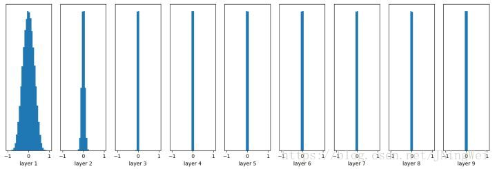

# 深度学习实践总结
## 1. 自然语言处理中如何进行数据增强
NLP 中应用数据增强比较困难的原因有两点：
- <font color='red'>NLP中的数据是离散的</font>。它的后果是我们无法对输入数据进行直接简单地转换，而大多数CV中则没有这个限制；
- <font color='red'>小的扰动可能会改变含义</font>。在NLP中，删掉一个否定词可能会改变整个句子的情绪，而修改一段话中的某个词甚至会改变语意。但CV不存在这种情况，不论图像中的是猫还是狗，扰动单个像素一般不会影响模型预测，甚至都不会出现明显变化，如插值就是一种有效的图像处理技术；

可尝试的数据增强的方法有：

1. <font color='red'>利用翻译技术扩充数据集</font>
  - 双向翻译：利用机器翻译做双向翻译——将语言 A 翻译到其他语言，再翻译回语言 A 这个过程相当于对样本进行了改写，使得训练样本的数量大大增加；
  - 单项翻译：利用机器翻译将数据集翻译成其他语言，后续的 NLP 任务采用新语言的词向量；
2. <font color='red'>同义词/反义词替换</font>
  - 通过替换单词或字符的同义词来创建正例；
  - 通过替换单词或字符的反义词来创建反例
3. <font color='red'>利用自动摘要技术扩充数据集</font>
  - 长文本分类问题，可采用自动摘要技术扩充数据集
4. 变分自动编码器、GAN 生成句子

## 2. Deep learning 都有哪些调参技巧？
### (1) 数据预处理
- 图片数据进行:
  - zero-center：`X -= np.mean(X, axis = 0)`
  - normalize: `X /= np.std(X, axis = 0)`
  - PCA whitening,这个用的比较少.
- 文本数据进行： 去除停用词、stem 词干化、拼写检查、繁简转化等等数据清洗。

### (2) 参数初始化 Weight Initialization
深度学习模型训练的过程本质是对 weight（即参数 W）进行更新，这需要每个参数有相应的初始值。<font color='red'>深度学习中的weight initialization对模型收敛速度和模型质量有重要影响！</font>
#### 全零初始化 (Zero Initialization)
如果所有的参数都是0，那么所有神经元的输出都将是相同的，那在back propagation的时候，gradient相同，weight update也相同。<font color='red'>同一层内所有神经元的行为也是相同的。更一般地说，如果权重初始化为同一个值，神经网络将是对称的，</font>意味着每个 layer 的每个神经元 neuro 学到的都是相同的特征，相当于每一层只有一个神经元，导致整个神经网络不够 powerful，退化为基本的线性分类器比如 logistic regression。
#### 随机初始化 (Random Initialization)
将参数值（通过高斯分布或均匀分布）随机初始化为 接近0的 一个很小的随机数（有正有负），从而使对称失效。

```
  W = tf.Variable(np.random.randn(node_in, node_out)) * 0.001
```
Note：
- node_in 、 node_out 表示 输入神经元个数 、输出神经元个数 ；
- np.random.randn(node_in, node_out) 输出 服从标准正态分布的 node_in × node_out 矩阵；
- 控制因子：0.001 ，保证参数期望接近0；
- 一旦随机分布选择不当，就会导致网络优化陷入困境。如下图10层的 NN 前向传播之后的权重分布:


随着层数的增加，我们看到输出值迅速向0靠拢，在后几层中，几乎所有的输出值x都很接近0！反向传播时直接导致gradient很小，使得参数难以被更新！
- 将初始值调大一些,均值仍然为0，标准差现在变为1，下图是每一层输出值分布的直方图：
```
W = tf.Variable(np.random.randn(node_in, node_out))
```


几乎所有的值集中在-1或1附近，神经元saturated了！同样导致了gradient太小，参数难以被更新。
#### Xavier initialization
<font color='red'>Xavier初始化的基本思想是保持输入和输出的方差一致，这样就避免了所有输出值都趋向于0。</font>加上了**方差规范化：/np.sqrt(node_in) ，维持了 输入、输出数据分布方差的一致性，从而更快地收敛。**
```
W = tf.Variable(np.random.randn(node_in, node_out)) / np.sqrt(node_in)
```
- tanh 激活函数下的 NN 每层的权重分布：


输出值在很多层之后依然保持着良好的分布，这很有利于我们优化神经网络！
- ReLU 激活函数下的 NN 每层的权重分布：


前面看起来还不错，后面的趋势却是越来越接近0。<font color='red'>He initialization可以用来解决ReLU初始化的问题</font>。
#### He initialization
在ReLU网络中，假定每一层有一半的神经元被激活，另一半为0，所以，要保持variance不变，只需要在Xavier的基础上再除以2：
```
W = tf.Variable(np.random.randn(node_in,node_out)) / np.sqrt(node_in/2)
```


#### Batch Normalization layer
<font color='red'>在非线性activation之前，输出值应该有比较好的分布（例如高斯分布），以便于back propagation时计算gradient</font>，更新weight。Batch Normalization将输出值强行做一次Gaussian Normalization和线性变换。
- 随机初始化基础上添加 BN 层：


很容易看到，Batch Normalization的效果非常好
#### 迁移学习初始化 (Pre-train Initialization)
将预训练模型的参数 作为新任务上的初始化参数(相当于给模型参数增加了一个很强的先验)。

### (3) <font color='red'>训练技巧</font>
- 要做梯度归一化,即算出来的梯度除以minibatch size；
- gradient clipping(梯度裁剪): 限制最大梯度,防止梯度爆炸；
- dropout对小数据防止过拟合有很好的效果， dropout的位置比较有讲究, 对于RNN,建议输出位置：输入->dropout->RNN、RNN->dropout->输出.
- adam,adadelta 等,在小数据上,我这里实验的效果不如sgd, sgd收敛速度会慢一些，但是最终收敛后的结果，一般都比较好。如果使用sgd的话,可以选择从1.0或者0.1的学习率开始,隔一段时间,在验证集上检查一下,如果cost没有下降,就对学习率减半. 我看过很多论文都这么搞,我自己实验的结果也很好. 当然, <font color='red'>也可以先用ada系列先跑,最后快收敛的时候,更换成sgd继续训练.同样也会有提升。</font>
- 除了gate之类的地方,需要把输出限制成0-1之外,尽量不要用sigmoid,可以用tanh或者relu之类的激活函数.1. sigmoid函数在-4到4的区间里，才有较大的梯度。之外的区间，梯度接近0，很容易造成梯度消失问题。2. 输入0均值，sigmoid函数的输出不是0均值的。
- rnn的dim和embdding size,一般从128上下开始调整. batch size,一般从128左右开始调整.batch size合适最重要,并不是越大越好.
- 训练时尽量对数据做shuffle
- LSTM 的forget gate的bias,用1.0或者更大的值做初始化,可以取得更好的结果,来自这篇论文:http://jmlr.org/proceedings/papers/v37/jozefowicz15.pdf, 我这里实验设成1.0,可以提高收敛速度.实际使用中,不同的任务,可能需要尝试不同的值.
- 多使用 Batch Normalization，relu+bn 的组合
- 如果你的模型包含全连接层（MLP），并且输入和输出大小一样，可以考虑将MLP替换成Highway Network,我尝试对结果有一点提升，建议作为最后提升模型的手段，原理很简单，就是给输出加了一个gate来控制信息的流动，详细介绍请参考论文: http://arxiv.org/abs/1505.00387
- 降学习率。随着网络训练的进行，学习率要逐渐降下来，各种 lr decay 策略；
- 充分利用 Tensorbord，观察模型训练情况，loss 和 acc 是否收敛正常，learning rate decay 时候合适，权重的分布是否平滑是否包含很多噪点；
- early stop 机制，保存验证机上最好的模型，同时做好 model checkpoint 的工作；
- 卷积核的分解。从最初的5×5分解为两个3×3，到后来的3×3分解为1×3和3×1，再到resnet的1×1，3×3，1×1，再xception的3×3 channel-wise conv+1×1，网络的计算量越来越小，层数越来越多，性能越来越好，这些都是设计网络时可以借鉴的；
- **不同尺寸的 feature maps的 concat，通过 up-sample 将不同尺寸的feature-map尺寸设置一样大，再合并**， 只用一层的feature map一把梭可能不如concat好，pspnet 就是这个思想，这个思想很常用。
- resnet的shortcut确实会很有用，重点在于shortcut支路一定要是identity，主路是什么conv都无所谓，据说是 resnet 作者所述
- 解决过拟合的一些手段

### (4) Ensemble
- 同样的参数,不同的初始化方式
- 不同的参数,通过cross-validation,选取最好的几组
- 同样的参数,模型训练的不同阶段，即不同迭代次数的模型。
- 不同的模型,进行线性融合. 例如RNN和传统模型.
- Vote、Average、Stacking 等
- Snapshot Ensemble
