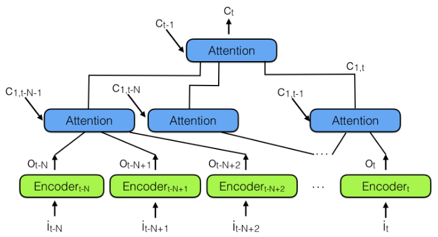
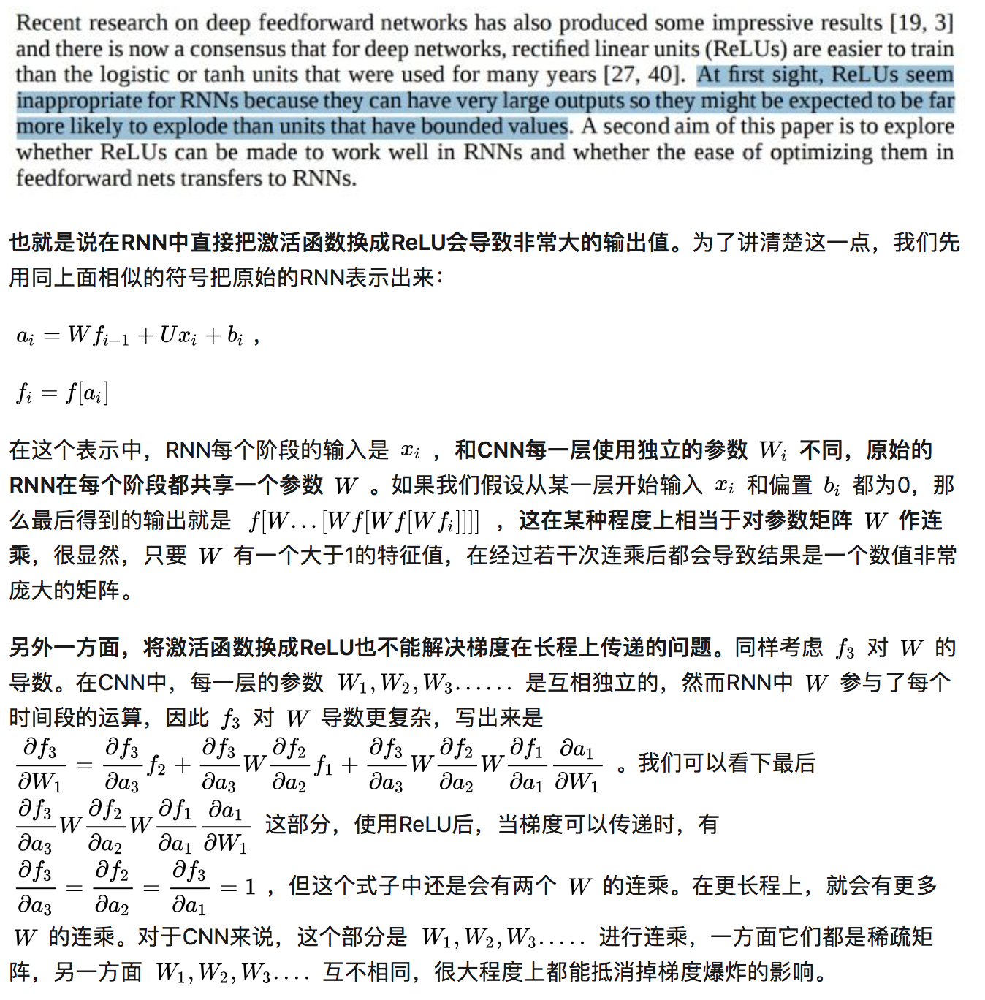
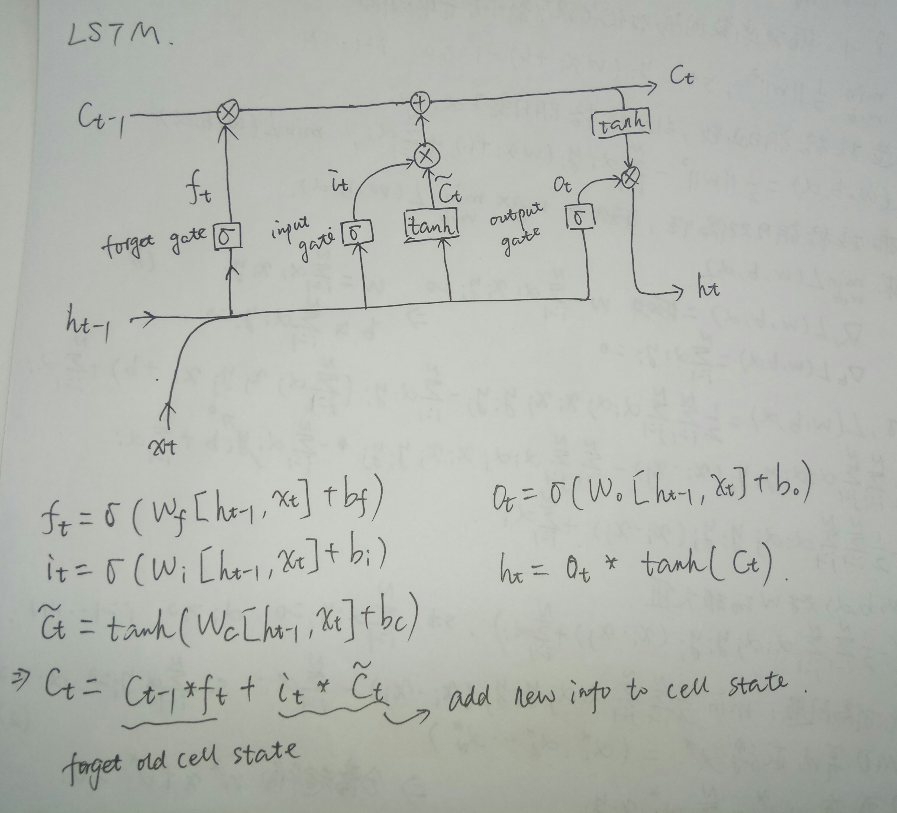
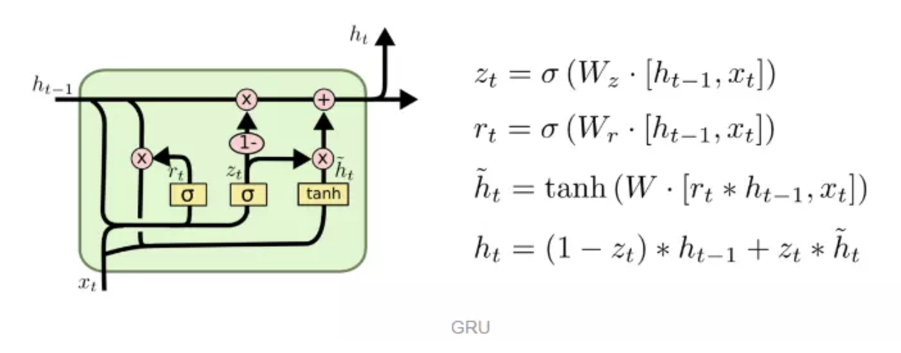

# Recurrent Neural Network
## 1. RNN、LSTM 本身存在哪些问题？
（1）RNN 需要更多的资源来训练，它和 硬件加速不匹配
> 训练 RNN 和 LSTM 非常困难，**因为计算能力受到内存和带宽等的约束**。简单来说，每个 LSTM 单元需要四个仿射变换，且每一个时间步都需要运行一次，这样的仿射变换会要求非常多的内存带宽。*添加更多的计算单元很容易，但添加更多的内存带宽却很难——这与目前的硬件加速技术不匹配*，一个可能的解决方案就是让计算在存储器设备中完成。

（2）RNN 容易发生梯度消失，即使是 LSTM
> 在长期信息访问当前处理单元之前，需要按顺序地通过所有之前的单元。这意味着它很容易遭遇梯度消失问题；LSTM 一定程度上解决了这个问题，但 LSTM 网络中依然存在顺序访问的序列路径——直观来说，LSTM 能跳过一段信息中不太重要的部分，但如果整段信息都很重要，它依然需要完整的顺序访问，此时就跟 RNN 没有区别了。

（3）改进：注意力机制模块（记忆模块）的应用
- 注意力机制模块可以同时前向预测和后向回顾。
- 分层注意力编码器（Hierarchical attention encoder）

- 分层注意力模块通过一个层次结构将过去编码向量汇总到一个上下文向量C_t ——这是一种更好的观察过去信息的方式（观点）
- 分层结构可以看做是一棵树，其路径长度为 logN，而 RNN/LSTM 则相当于一个链表，其路径长度为 N，如果序列足够长，那么 N >> logN

## 2. RNN中为什么要采用tanh而不是ReLu作为激活函数？
（1）RNN中直接把激活函数换成ReLU会导致非常大的输出值，容易导致梯度爆炸。

（2）基于门机制的RNN单元
LSTM 的门控机制依赖于激活函数，遗忘门经过sigmoid函数之后映射成(0,1)之间的数，来控制状态的保留程度；输入门的 sigmoid 控制加入新的信息的程度，同时 tanh 控制增加信息还是减少信息 tanh(-1, 1)。

## LSTM 和 GRU 神经元结构

