# 机器学习基础
## 1. 列举常见的一些范数及其应用场景，如 L0，L1，L2，L∞，Frobenius 范数？
:star::star::star:
- L0：向量中非零元素的个数，L1范数通常作为替代函数；
- L1：向量中所有元素的绝对值之和

- L2：向量中所有元素平方和的平方根

- L∞: 向量中最大元素的绝对值，也称最大范数

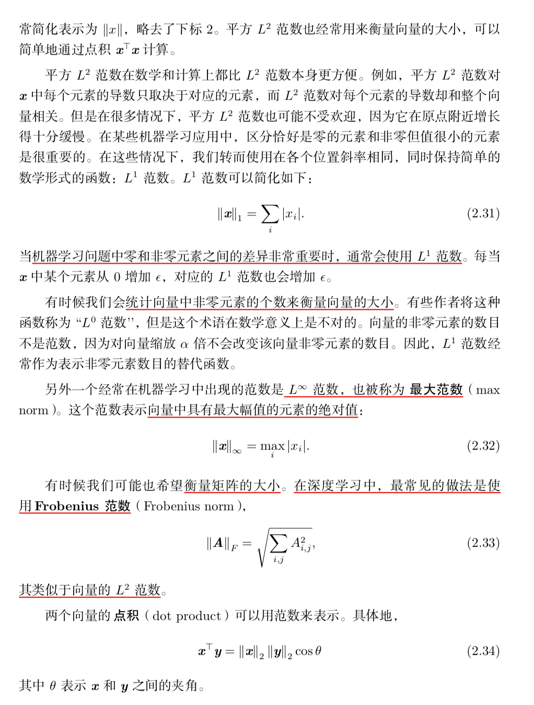
参数范数惩罚——深度学习中的正则化

- 只有在显著减小目标函数方向上的参数会保留得相对完好。在无助于目标函数减小的方向(对应 Hessian 矩阵较小的特征值)上改变参数不会显著增加梯度。这种不重要方向对应的分量会在训练过程中因正则化而衰减掉。

## 2. 为什么通常只对权重做正则化惩罚而不对偏置做正则惩罚？:star::star:
- 在神经网络中，参数包 括每一层仿射变换的权重和偏置，我们通常只对权重做惩罚而不对偏置做正则惩罚；
- 准确拟合偏置所需要的数据比拟合权重少得多，每个权重会指定两个变量如何相互作用 Y=Wx。我们需要在各种条件下观察这两个变量才能良好地拟合权重，而每个偏置仅控制一个单变量。意味着，不对偏置进行正则化也不会导致太大的方差；
- 正则化偏置参数可能会导致明显的欠拟合。

## 3. L1 正则和 L2 正则的区别？为什么 L1 倾向于权重稀疏化？:star::star::star::star:
- https://blog.csdn.net/zouxy09/article/details/24971995/

（1）L1 正则
L1正则化还能起到使参数更加稀疏的作用，稀疏化的结果使优化后的参数一部分为0，另一部分为非零实值。非零实值的那部分参数可起到选择重要参数或特征维度的作用，同时可起到去除噪声的效果。

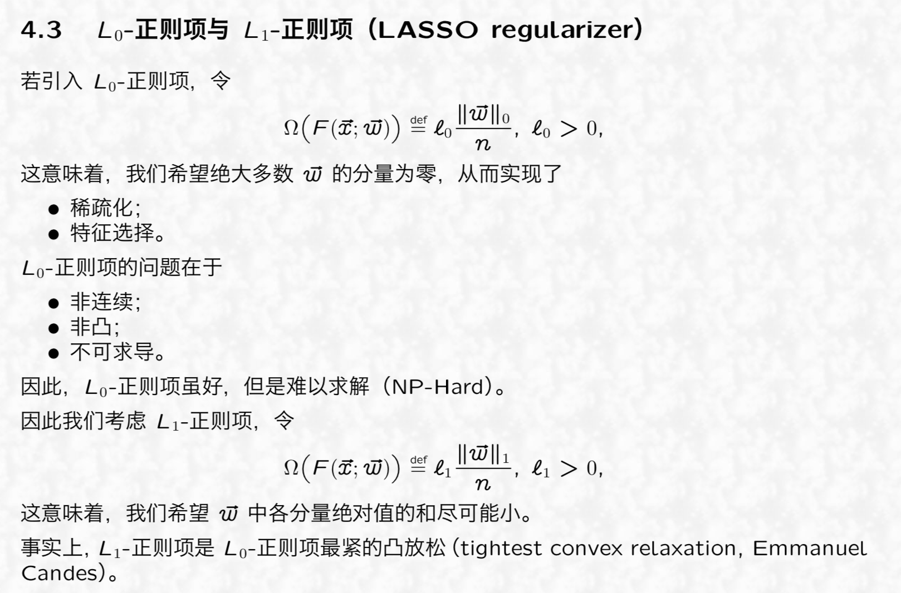
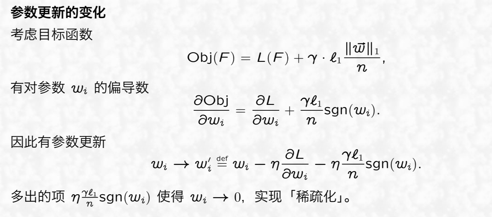

（2）L2 正则

**L2 正则通常对稀疏的有尖峰的权重向量施加大的惩罚，而偏好于均匀的参数。这样的效果是鼓励神经单元利用上层的所有输入，而不是部分输入**。所以L2正则项加入之后，权重的绝对值大小就会整体倾向于减少，尤其不会出现特别大的值（比如噪声），即网络偏向于学习比较小的权重。所以L2正则化在深度学习中还有个名字叫做“权重衰减”（**weight decay**）

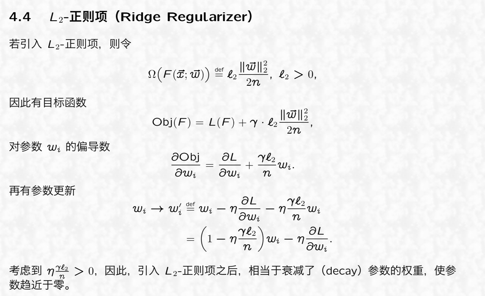

（3）正则化对偏导的影响

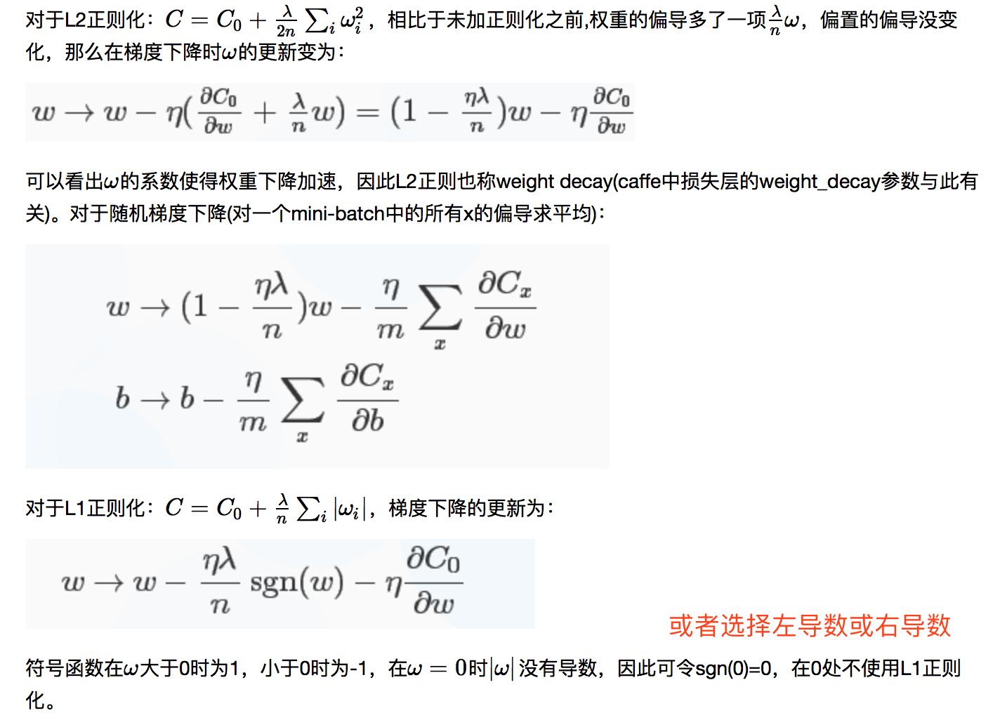

（4）正则化对目标函数曲面的影响

可以看出：**L2范数不但可以防止过拟合，还可以让我们的优化求解变得稳定和快速。**

（4）L1 使得权重稀疏，L2 使得权重平滑
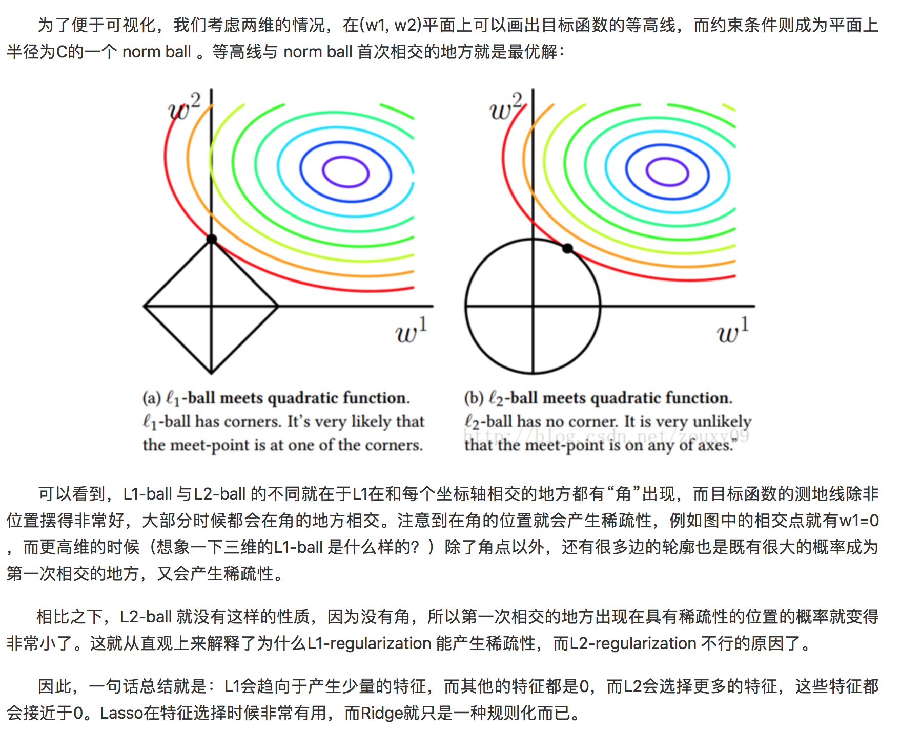

（4）L1 和 L2 的区别
- 梯度中，L1 减少的是一个常量，L2减少的是权重的固定比例
- L1使权重稀疏，L2使权重平滑，一句话总结就是：L1会趋向于产生少量的特征，而其他的特征都是0，而L2会选择更多的特征，这些特征都会接近于0

## 4. L1、L2 正则化与数据先验分布的关系？:star::star::star::star:

我们知道 L1 正则会使得权重稀疏化，L2 正则使得权重平滑（见问题1）。

- x1,x2为权重系数

先引入结论：
> - 贝叶斯学习过程将权重视为不确定的，并且可以通过概率分布表示这种不确定性，正则化即是为权重增加先验分布。
> - 从贝叶斯的角度来分析，正则化是为模型参数估计增加一个先验知识，**先验知识会引导损失函数最小值过程朝着约束方向迭代**。
> - L1 正则相当于为模型参数估计增加一个拉普拉斯先验；L2 正则相当于为模型参数估计增加一个高斯先验。

以线下回归为例，损失函数为：

这里没有对参数 W 加入任何先验分布，在数据维度很高的情况下，模型参数很多，模型复杂度高，容易发生过拟合。

（1）L2 正则：Ridge Regression —— 对参数 w 引入scale parameter为1 的零均值高斯先验

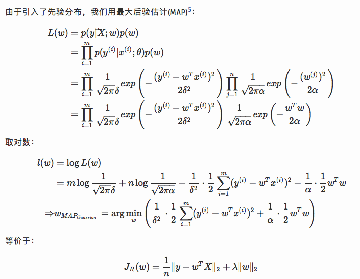

此即 L2 正则化后的损失函数。

（2）L1 正则：Lasso Regression —— 对参数 w 引入位置参数为0尺度参数为 b 的拉普拉斯先验

Lasso 全称 least absolute shrinkage and selection operator

总结：
> 正则化参数等价于对参数引入**先验分布**，使得 模型复杂度变小（缩小解空间），对于噪声以及outliers的鲁棒性增强（泛化能力）。整个最优化问题从贝叶斯观点来看是一种**贝叶斯最大后验估计，其中 正则化项 对应后验估计中的 先验信息 ，损失函数对应后验估计中的似然函数，两者的乘积即对应贝叶斯最大后验估计的形式**。

- https://www.zhihu.com/question/23536142
- https://www.jianshu.com/p/a47c46153326

## 5. 实际应用中，为什么 L2 正则表现往往会优于 L1 正则？:star::star::star:
- （1）从贝叶斯角度

L1 正则相当于为模型参数估计增加一个拉普拉斯先验分布；L2 正则相当于为模型参数估计增加一个高斯先验分布。
其中高斯分布和拉普拉斯分布曲线图：

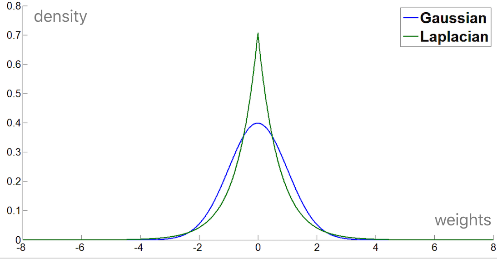

从权重分布的角度看，由于L2倾向于把权重限制在一个小的范围，而L1直接将小的权重归0。L1 正则偏向权重稀疏化，趋向于产生少量的特征，而其他的特征都是0或趋于0，即起到特征选择的作用，而 L2 正则不具有产生稀疏解的能力，假设模型预测结果与两个特征相关，L2 正则倾向于综合两者的影响，给影响大的特征赋予高的权重；而L1
正则倾向于选择影响较大的参数，而舍弃掉影响较小的那个。稀疏化的过程会伴随一定的信息损失，从而一定程度上降低模型性能。
> Typically ridge or ℓ2 penalties are much better for minimizing prediction error rather than ℓ1 penalties. The reason for this is that when two predictors are highly correlated, ℓ1 regularizer will simply pick one of the two predictors. In contrast, the ℓ2 regularizer will keep both of them and jointly shrink the corresponding coefficients a little bit. Thus, while the ℓ1 penalty can **certainly reduce overfitting, you may also experience a loss in predictive power**.

- (2) 正则化对目标函数曲面影响角度（梯度下降影响角度）

可以看出：在局部最小值点附近，L2 使得目标函数曲面凸化，梯度可以保持较大，而 L1 使得曲面平坦，梯度几乎不变，减缓梯度下降。因此：**L2范数不但可以防止过拟合，还可以让我们的优化求解变得稳定和快速。**

- （3）L1 和 L2 结合：Elastic Net

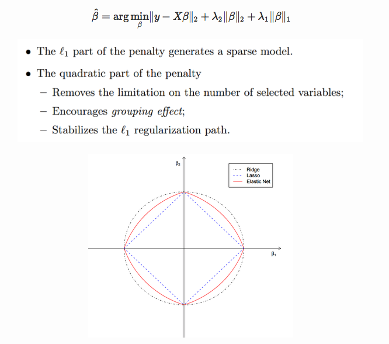

## 6. 偏差 Bias 和方差 Variance 的区别和联系？
模型的泛化误差 Error = Bias^2 + Variance + Noise。Bias和Variance是针对Generalization而言的。其数学定义：

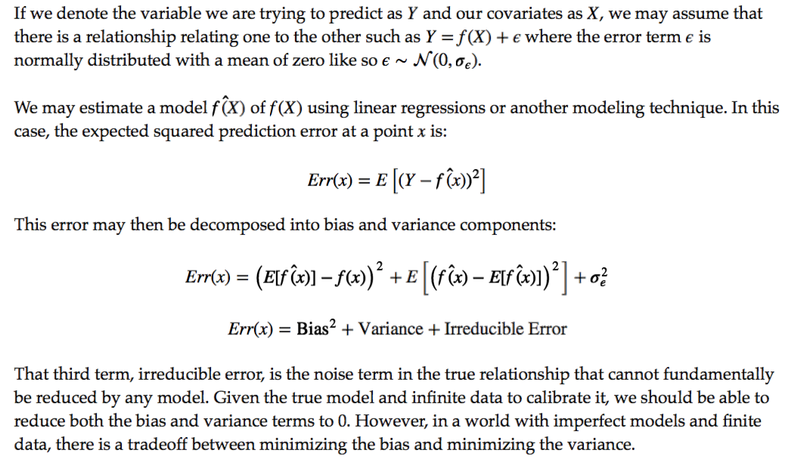

- Bias 反应的是模型在样本上期望输出和真实标记的误差，度量了模型期望预测和真实结果的偏离程度，即刻画了模型本身的拟合能力；
- Variance 度量了同样大小的训练集的变动所导致的学习性能的变化，即刻画了数据扰动所造成的影响；
- Noise 则表达了当前任务上任何学习算法所能打到的期望泛化误差的下届，即刻画了学习问题本身的难度。

（可以看出，泛化性能是由学习算法的能力、数据的本身分布、学习任务本身的难度所共同决定的）

（2）Bias Variance Trade-off

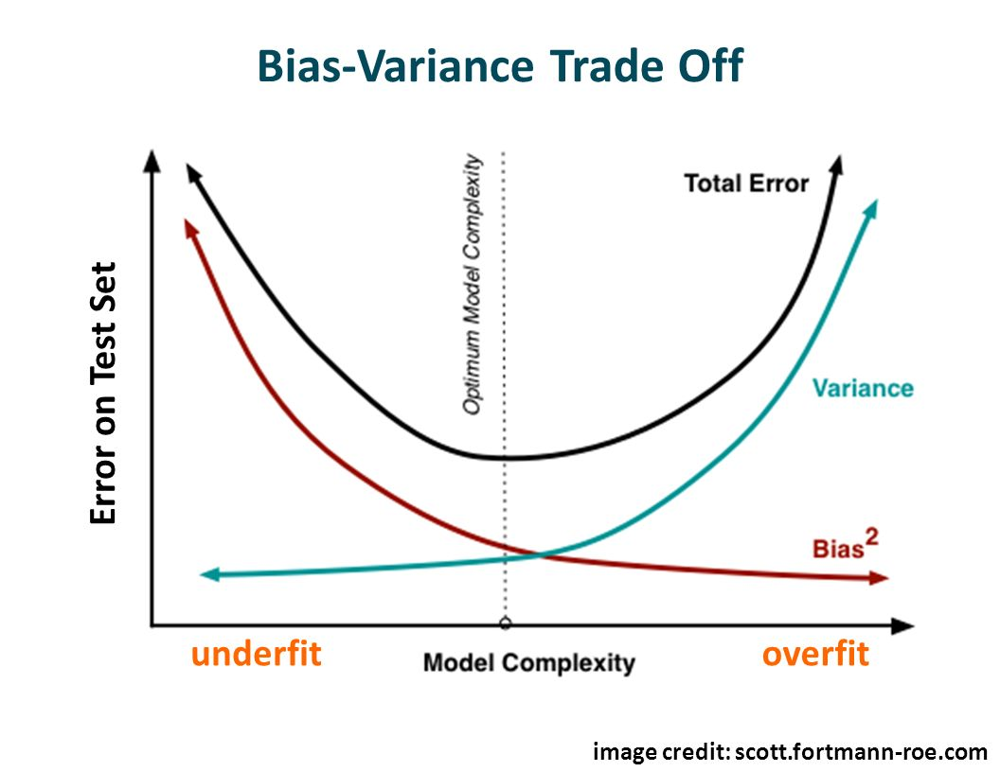

- 模型训练前期，模型拟合能力不足，训练集的扰动不足以使模型产生显著变化，此时偏差bias主导了泛化误差；
- 随着训练程度加深，模型拟合能力逐渐增强，训练数据发生的扰动逐渐被模型学习到，方差 variance 逐渐主导了泛化误差；
- 在训练程度充足后，模型拟合能力非常强，训练数据的轻微扰动都会导致模型发生显著变化，则发生过拟合。

## 7. 如何解决样本不均衡问题？:star::star::star:
- **随机采样**：通过上采样和下采样解决，即多的样本通过取其中一部分，少的样本重复利用。但是他们也存在一些问题。对于随机欠采样，由于采样的样本要少于原样本集合，因此会造成一些信息缺失，未被采样的样本往往带有很重要的信息。对于随机过采样，由于需要对少数类样本进行复制因此扩大了数据集，造成模型训练复杂度加大，另一方面也容易造成模型的过拟合问题
- **SMOTE算法**：合成少数类过采样技术，它是基于随机过采样算法的一种改进方案，由于随机过采样采取简单复制样本的策略来增加少数类样本，这样容易产生模型过拟合的问题，即使得模型学习到的信息过于特别(Specific)而不够泛化(General)，SMOTE算法的基本思想是对少数类样本进行分析并根据少数类样本人工合成新样本添加到数据集中。
  - 对于少数类中每一个样本 `x`，以欧氏距离为标准计算它到少数类样本集 `S_min` 中所有样本的距离，得到其 `k近邻`;
  - 根据样本不平衡比例设置一个采样比例以确定采样倍率 `N`，对于每一个少数类样本 `x`，从其 k 近邻中随机选择若干个样本，假设选择的近邻为 {Xi~.....Xk~};
  - 对于每一个随机选出的近邻 `hat{x}`，分别与原样本按照如下的公式构建新的样本。
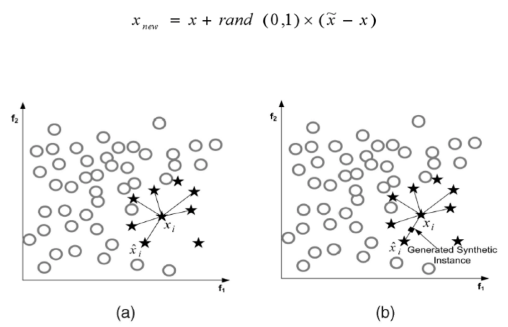
- **代价敏感学习**：核心要素是代价矩阵。从学习模型出发，可以对学习模型进行改造以适应不平衡数据下对学习；从贝叶斯风险理论出发，可以看作是分类结果的后处理；从预处理的角度出发，可以将代价看作权重调整;
- **修改评测指标**: 正确率或错误率并不能表示不平衡数据下模型的表现，改用 F 值，F值同时考虑到了少数类的准确率和召回率，以及利用 ROC 曲线改用 AUC 指标；
- **修改loss函数**：修改样本权值，让少的样本得到更大的权值；
- **问题转换**：将不平衡的二分类问题转换成异常检测问题。

## 8. 机器学习中有哪些常用损失函数？:star::star::star::star:
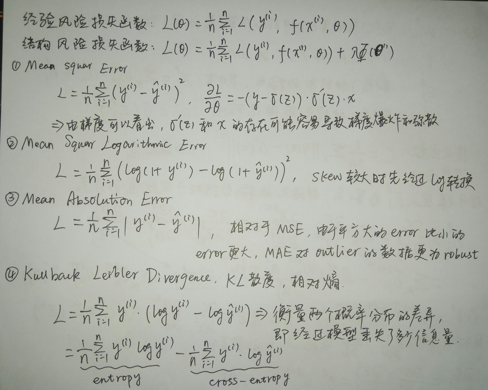
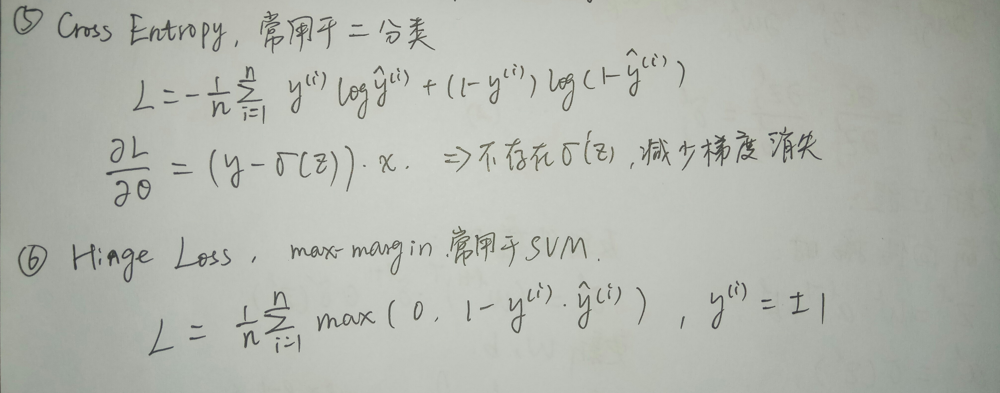

## 9. 什么是特征的多重共线性，与过拟合有什么关联？
- 多重共线性：在多元线性回归模型经典假设中，其重要假定之一是回归模型的解释变量之间不存在线性关系，也就是说，解释变量X1，X2，……，Xk中的任何一个都不能是其他解释变量的线性组合。多重共线性是指线性回归模型的解释变量之间由于存在精确相关关系或者高度相关关系而使模型评估失真或者不准确。
  - 度量多重共线性严重程度的一个重要指标是 **矩阵的条件数**（*矩阵A的条件数等于A的范数与A的逆的范数的乘积，即cond(A)=‖A‖·‖A^(-1)‖* ）
  - 相关性的检验：通过方差的膨胀因子检验相关性。方差膨胀因子（Variance Inflation Factor，VIF）：是指解释变量之间存在多重共线性时的方差与不存在多重共线性时的方差之比。经验判断方法表明：当0<VIF<10，不存在多重共线性；当10≤VIF<100，存在较强的多重共线性；当VIF≥100，存在严重多重共线性
- 多重共线性容易导致过拟合，多重共线性问题的实质是样本信息的不充分而导致模型参数的不能精确估计，冗余的信息可能引入噪声。
- 消除复共线性的方法有如下几种：
  - 自变量之间存在共线性，说明自变量所提供的信息是重叠的，可以删除不重要的自变量减少重复信息。
  - 对输入变量进行降维，比如用主成分分析法。也就是用主成分分析先处理输入变量，然后再做回归；
  - 另外一种方法则是加正则项。

## 10. 生成模型与判别模型的区别？
- 监督学习的任务是学习一个模型，对给定的输入预测相应的输出，这个模型的一般形式为一个决策函数或一个条件概率分布（后验概率）：

其中：
- **决策函数**：输入 X 返回 Y；其中 Y 与一个阈值比较，然后根据比较结果判定 X 的类别
- **条件概率分布**：输入 X 返回 X 属于每个类别的概率；将其中概率最大的作为 X 所属的类别

- 监督学习模型可分为生成模型与判别模型
  - **判别模型直接学习决策函数或者条件概率分布.**
  - 直观来说，判别模型学习的是类别之间的最优分隔面，反映的是不同类数据之间的差异

**两者之间的联系**
- 由生成模型可以得到判别模型，但由判别模型得不到生成模型。
- 当存在“隐变量”时，只能使用生成模型
>隐变量：当我们找不到引起某一现象的原因时，就把这个在起作用，但无法确定的因素，叫“隐变量”

**优缺点**
- 判别模型
  - 优点
    - 直接面对预测，往往学习的准确率更高
    - 由于直接学习 P(Y|X) 或 f(X)，可以对数据进行各种程度的抽象，定义特征并使用特征，以简化学习过程
  - 缺点
    - 不能反映训练数据本身的特性

- 生成模型
  - 优点
    - 可以还原出联合概率分布 P(X,Y)，判别方法不能
    - 学习收敛速度更快——即当样本容量增加时，学到的模型可以更快地收敛到真实模型
    - 当存在“隐变量”时，只能使用生成模型
  - 缺点
    - 学习和计算过程比较复杂

**常见模型**
- 判别模型
  - K 近邻、感知机（神经网络）、决策树、逻辑斯蒂回归、最大熵模型、SVM、提升方法、条件随机场
- 生成模型
  - 朴素贝叶斯、隐马尔可夫模型、混合高斯模型、贝叶斯网络、马尔可夫随机场

## 11. 余弦相似度（Cos距离）与欧氏距离的区别和联系
- 欧式距离和余弦相似度都能度量 2 个向量之间的相似度
- 放到向量空间中看，欧式距离衡量两点之间的直线距离，而余弦相似度计算的是两个向量之间的夹角
- 没有归一化时，欧式距离的范围是 (0, +∞]，而余弦相似度的范围是 (0, 1]；
- 余弦距离是计算相似程度，而欧氏距离计算的是相同程度（对应值的相同程度）
- 归一化的情况下，可以将空间想象成一个超球面（三维），欧氏距离就是球面上两点的直线距离，而向量余弦值等价于两点的球面距离，本质是一样。

## 12. 混淆矩阵、准确率、精确率、召回率、F1 值、ROC、AUC等

## 11. SVM 和 LR 有什么异同？
http://www.cnblogs.com/zhizhan/p/5038747.html
