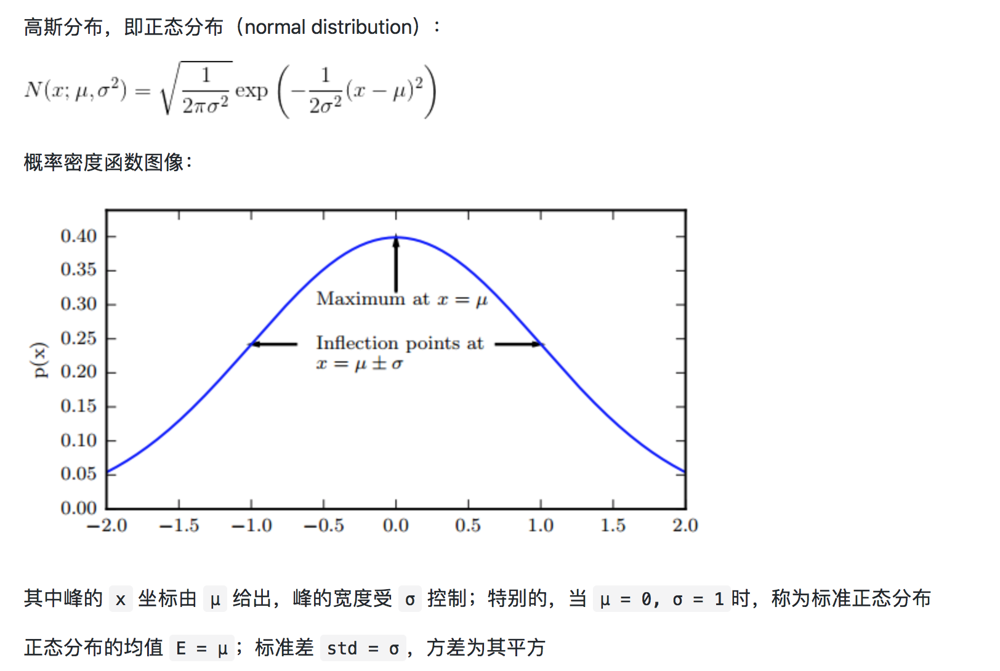

# 数理统计
## 1. 信息熵、KL 散度（相对熵）与交叉熵?
## 2. 如何避免数值计算中的上溢和下溢问题，以 softmax 为例？
（1）对于 softmax 函数：

通常情况下，计算softmax函数值不会出现什么问题,当某些情况发生时，计算函数值就出问题了：
- 指数的系数`xi`极其大的时候，计算指数出现上溢出；
- `xi` 为负数，且`|xi|`很大的时候，指数的值为极小的正数，计算指数出现下溢出；
- 针对 sigmoid 的结果如果需要计算 log，如logloss，如果 `xi` 为负数，且`|xi|`很大的时候，指数的值为极小的正数，分子四舍五入为 0，计算 log(softmax) 相当于计算  log(0) ，所以会得到 −∞ ，但这实际上是错误的，因为它是由舍入误差造成的计算错误。

（2）解决办法：

- 数据预处理，将原数据减去最大值，令  M=max(xi),i=1,2,⋯,n ，即 M 为所有 xi 中最大的值，那么我们只需要把计算 f(xi) 的值，改为计算  f(xi−M) 的值，就可以解决上溢出、下溢出的问题了, 同时计算结果不变。

- 对于求 log(softmax)，同样的方法，可以看出 log 后面的表达式求和项中，至少有一项的值为1（最大值M的时候），这使得log后面的值不会下溢出。

## 3. 高斯分布的广泛应用的原因，为什么推荐使用高斯分布？

当我们由于缺乏关于某个实数上分布的先验知识而不知道该选择怎样的形式时，正态分布是默认的比较好的选择，其中有两个原因：
- 我们想要建模的很多分布的真实情况是比较接近正态分布的。**中心极限定理（central limit theorem）** 说明很多独立随机变量的和近似服从正态分布。这意味着在实际中，很多复杂系统都可以被成功地建模成正态分布的噪声，即使系统可以被分解成一些更结构化的部分。
- 第二，在具有相同方差的所有可能的概率分布中，正态分布在实数上具有最大的不确定性。因此，我们可以认为正态分布是对模型加入的先验知识量最少的分布。

## 4. 如何理解最大似然估计和最小二乘法？
（1） **最大似然估计：利用已知的样本的结果，在使用某个模型的基础上，反推最有可能导致这样结果的模型参数值**。

现在已经拿到了很多个样本（你的数据集中所有因变量），这些样本值已经实现，最大似然估计就是去找到那个（组）参数估计值，使得前面已经实现的样本值发生概率最大。因为你手头上的样本已经实现了，其发生概率最大才符合逻辑。这时是求样本所有观测的联合概率最大化，是个连乘积，只要取对数，就变成了线性加总。此时通过对参数求导数，并令一阶导数为零，就可以通过解方程（组），得到最大似然估计值。

可以看出最大似然估计涉及概率分布，用于分类问题。

求解最大似然估计的一般过程为：
  - 写出似然函数；
  - 如果无法直接求导的话，对似然函数取对数；
  - 求导数 ；
  - 求解模型中参数的最优值。

（2） **最小二乘法：找到一个（组）估计值，使得实际值与估计值的距离最小**。本来用两者差的绝对值汇总并使之最小是最理想的，但绝对值在数学上求最小值比较麻烦，因而替代做法是，找一个（组）估计值，使得实际值与估计值之差的平方加总之后的值最小，称为最小二乘。“二乘”的英文为least square，其实英文的字面意思是“平方最小”。这时，将这个差的平方的和式对参数求导数，并取一阶导数为零。

可以看出最小二乘法涉及距离，用于回归问题。

（3）论及本质，其实两者只是用不同的度量空间来进行的投影，最小二乘法的度量是 L2 norm distance，而极大似然的度量是 Kullback-Leibler divergence.

## 5. 先验概率、后验概率和朴素贝叶斯？
（1）条件概率（似然概率）
- 一个事件发生后另一个事件发生的概率。
- 一般的形式为 P(X|Y)，表示 y 发生的条件下 x 发生的概率。
- 有时为了区分一般意义上的条件概率，也称似然概率

（2）先验概率
- 事件发生前的预判概率
- 可以是基于历史数据的统计，可以由背景常识得出，也可以是人的主观观点给出。
- 一般都是单独事件发生的概率，如 P(A)、P(B)。

（3）后验概率
- 基于先验概率求得的反向条件概率，形式上与条件概率相同（若 P(X|Y) 为正向，则 P(Y|X) 为反向）

（4）贝叶斯公式

## 6. 协方差和相关性有什么区别？
协方差的定义如下，如果X和Y是联合分布的随机变量，且分别有期望μX，μY，那么X和Y的协方差为

- 正的协方差表达了正相关性，负的协方差表达了负相关性。对于同样的两个随机变量来说，计算出的协方差越大，相关性越强。
- 可以看出协方差存在量纲，不方便进行横向比较，比如 cov(A,B)=100, cov(A,C)=10，相关程度不好比较

相关系数是“归一化”的协方差：

- 相关系数是用协方差除以两个随机变量的标准差，无计量单位变化。
